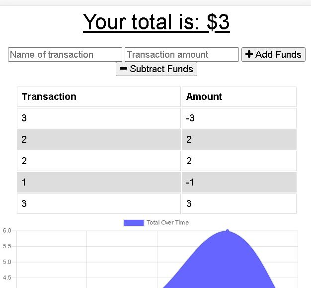

# offline-budget-tracker

## Project Title

offline-budget-tracker

## Project Link

- https://github.com/jamesrowe1/offline-budget-tracker
- https://offline-budget-jamesrowe.herokuapp.com/

## Screenshot

## Getting Started

Begin by navigating to the heroku app website located above. Once there, you will see two your current balance, along with two inputs, "Name of transaction" and "Transaction amount". You can input the correct information there, and then click either "Add funds" or "Subtract Funds" depending on what kind of transaction it is.

Below, you will see a list of all your transactions, along with a chart showing your balance over time.

## Prerequisites

You must have a working web browswer.

## Built With

- Visual Studio Code
- JavaScript
- Node
  - MongoDB
  - compression
  - express
  - mongojs
  - lite-server
  - mongoose
  - morgan
- Code hosted by Github
- App hosted by Heroku

## Authors

James Rowe

## License

Licensed under Awesome Coding L.L.C. (not a real company)

## Troubleshooting

For any issues contact James Rowe

## Acknowledgments

- Ben Wright
- Justin Pinero
- Wilson Linares